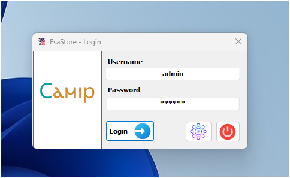
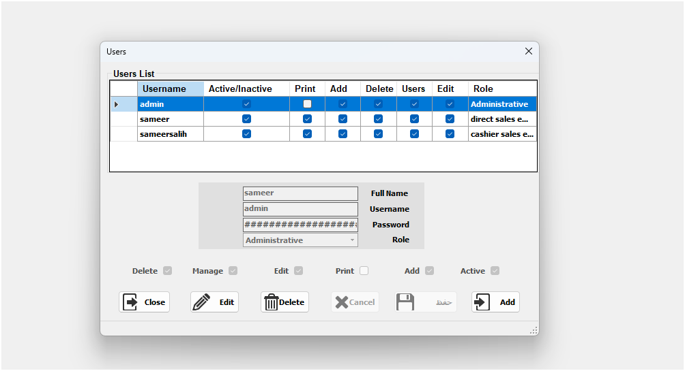
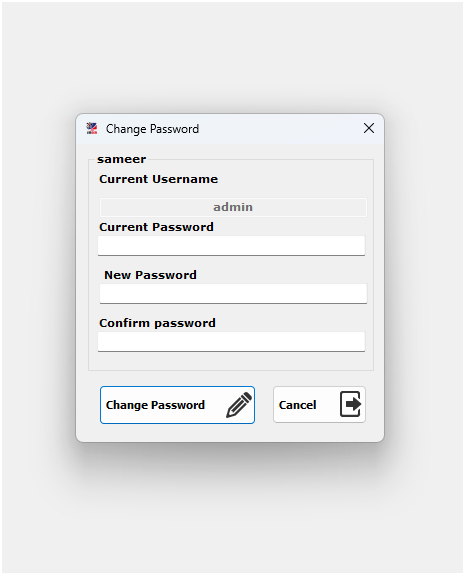
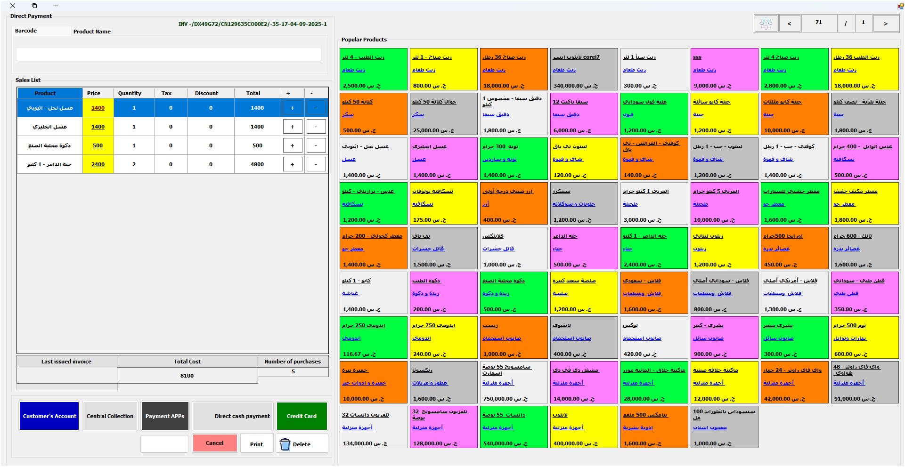
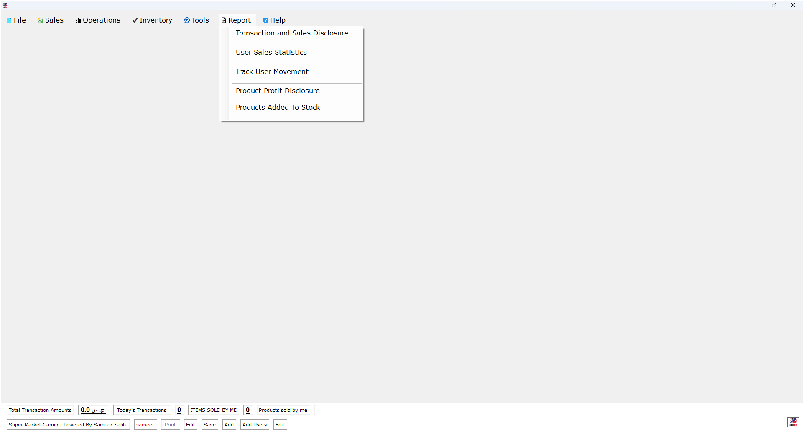
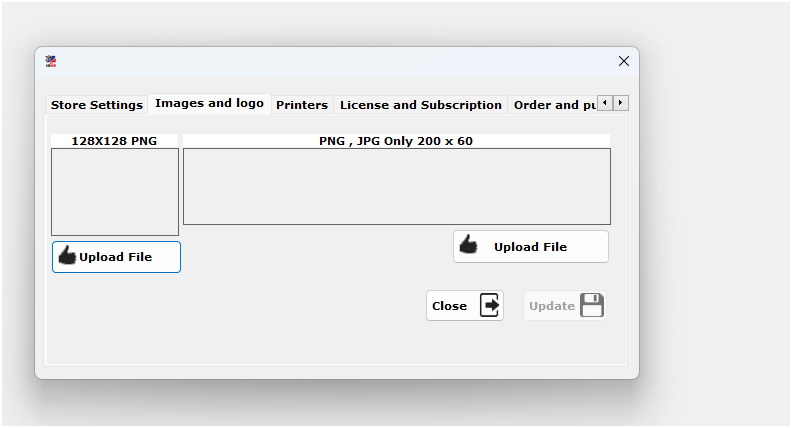
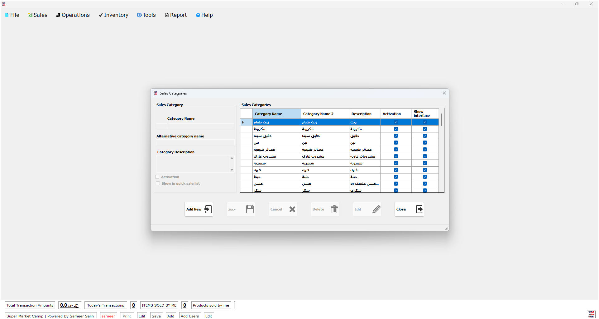
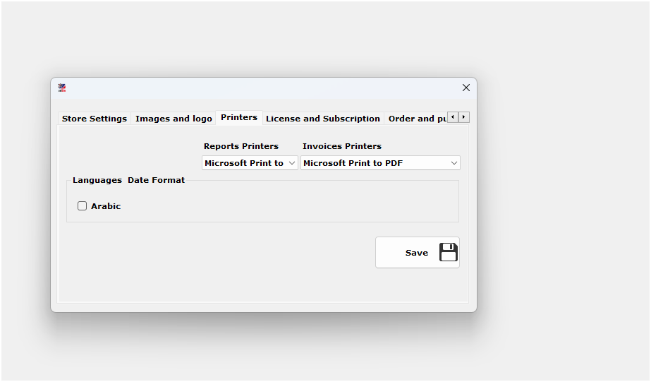
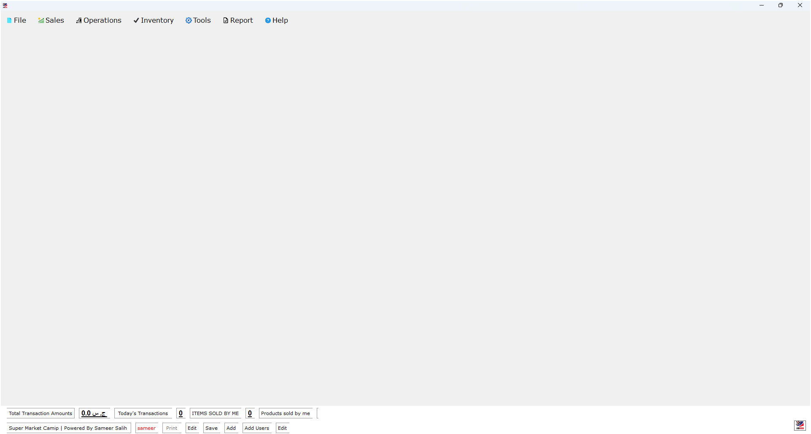
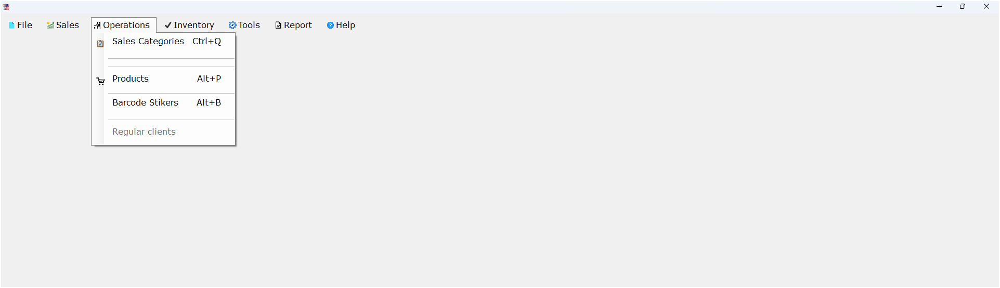

  

<h1 align="center">🛒 Camip ESA Store | نظام نقاط البيع</h1>

---

## 🇸🇩 بالعربية

**Camip ESA Store** هو نظام نقاط بيع مكتبي مصمم باستخدام **Visual Basic .NET**، يعتمد على قاعدة بيانات **MySQL**، ويستخدم **Crystal Reports** لتوليد التقارير. يخدم المتاجر المحلية في السودان بواجهة سهلة وعمليات دقيقة.

### ⚙️ المميزات
- إدارة المنتجات والمخزون
- تسجيل المبيعات اليومية
- طباعة الفواتير للعملاء
- تقارير مالية ومخزنية باستخدام Crystal Reports
- دعم المستخدمين والصلاحيات
- واجهة مكتبية مناسبة للأجهزة المحلية
## 🖼️ لقطات من النظام

| شاشة الدخول | إدارة المستخدمين | تغيير كلمة المرور |
|--------|--------|--------|
|  | |  |

| شاشة 4 | شاشة 5 | شاشة 6 |
|--------|--------|--------|
|  |  | |

| شاشة 7 | شاشة 8 | شاشة 9 |
|--------|--------|--------|
||  |  |

| شاشة 10 | شاشة 11 | شاشة 12 |
|---------|---------|---------|
|  |  | .png) |

| شاشة 13 | شاشة 14 | شاشة 15 |
|---------|---------|---------|
| .png) | .png) | .png) |

### 🧪 بيئة التطوير
- اللغة: Visual Basic .NET  
- قاعدة البيانات: MySQL  
- التقارير: Crystal Reports  
- نظام التشغيل: Windows

### 🔐 بيانات الدخول الافتراضية
اسم المستخدم: admin
كلمة المرور: Admin

**In English**
 
 
 **Camip ESA Store is a desktop Point of Sale system built with Visual Basic .NET, powered by a MySQL database, and uses Crystal Reports for generating detailed financial and inventory reports. It’s tailored for local Sudanese stores with a simple interface and reliable operations.

⚙️ Features
Product and inventory management

Daily sales tracking

Invoice printing for customers

Financial and inventory reports via Crystal Reports

User roles and access control

Desktop-friendly interface

🧪 Development Stack
Language: Visual Basic .NET

Database: MySQL

Reporting: Crystal Reports

OS: Windows

